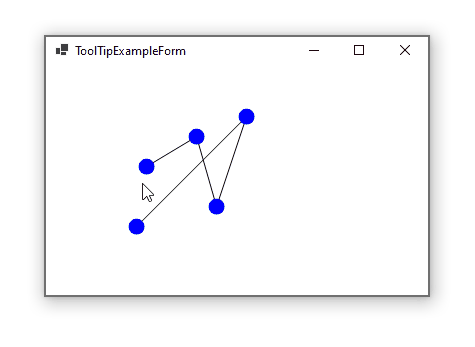

# Show ToolTip for drawing objects

The [ToolTip](https://docs.microsoft.com/en-us/dotnet/desktop/winforms/controls/tooltip-component-windows-forms?view=netframeworkdesktop-4.8&WT.mc_id=DT-MVP-5003235) component is an extender provider which extends controls. But if you want to show tooltip for some custom drawings (Which are not controls) which you have drawn on surface of a control, you need to handle tooltip yourself. To do so, you need to do the followings:

- Implement hit-testing for your node, so you can get the node under the mouse position.
- Create a timer and In mouse move event handler of the drawing surface, do hit-testing to find the hot item. If the hot node is not same as the current hot node, you stop the timer, otherwise, if there's a new hot item you start the timer.
- In the timer tick event handler, check if there's a hot item, show the tooltip and stop the time.
- In the mouse leave event of the drawing surface, stop the timer.

And here is the result, which shows tooltip for some points in a drawing:

The above algorithm, is being [used in internal logic of ToolStrip control](https://referencesource.microsoft.com/?WT.mc_id=DT-MVP-5003235#System.Windows.Forms/winforms/Managed/System/WinForms/ToolStrip.cs,3830beeb7db4a1c6) to show tooltip for the tool strip items (which are not control). So without wasting a lot of windows handle, and using a single parent control and a single tooltip, you can show tooltip for as many nodes as you want.

